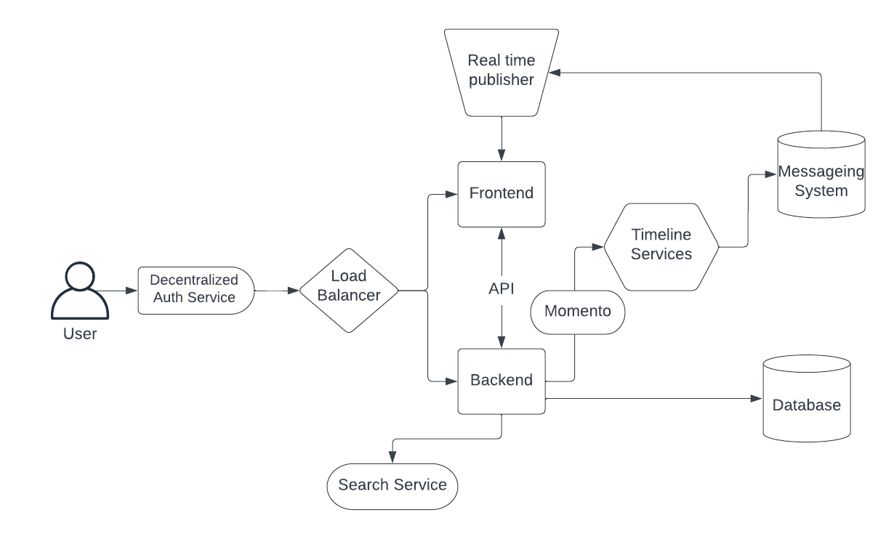
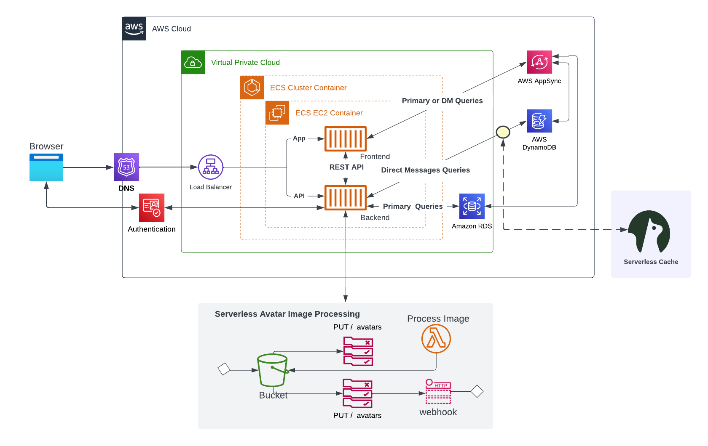
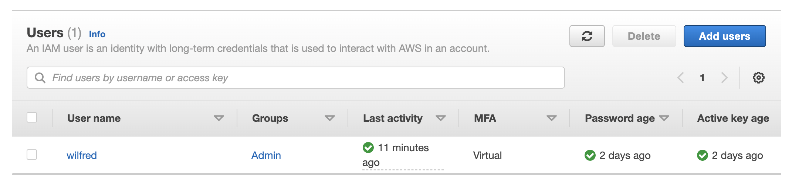
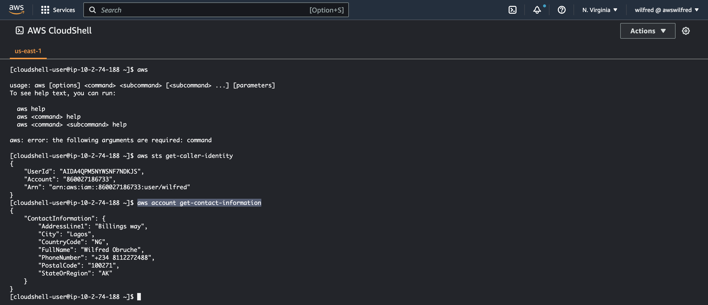
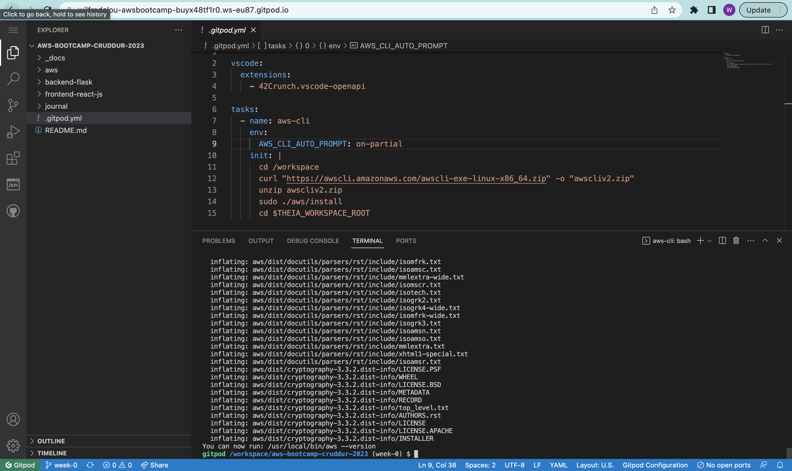

# Week 0 — Billing and Architecture


## Required Homework

### 1. Recreate Conceptual Diagram in Lucid Charts 
I created my conceptual diagram on lucid chart. It was my first time to use lucid chart so I watched a tutorial on youtube which helped me to use it properly.

[Conceptual Diagram In Lucid Chart](https://lucid.app/lucidchart/7c9fc557-36ba-4416-bc4d-3b3d8e60a7f1/edit?viewport_loc=-37%2C66%2C1579%2C841%2C0_0&invitationId=inv_091fdb93-da76-450d-9e0b-62cd910dd308)
Preview below


### 2. Recreate Logical Architectual Diagram in Lucid Charts 
[Logical Architectual Diagram](https://lucid.app/lucidchart/0e44d5f7-6068-4d37-ab77-d643906a6641/edit?viewport_loc=-34%2C40%2C1768%2C935%2C0_0&invitationId=inv_1c2e83f5-d8ad-449e-95e5-4ead14b8e3bc)
Preview below


### 3. Create an Admin User
While creating the admin user, I created a `User Group` with the `AdministratorAccess` permission and added the user to it.
With the user group I can easily manage all users with administrative permission.
I added `MFA` to the admin user for extra security layer to the user.


### 4. Use CloudShell
The AWS CloudShell is a web based and pre-authenticated shell for utilizing AWS resources via the command line.
I ran commands on the Cloudshell to examine their output. Some these commands are: 
- `aws`
- `aws help`
- `aws sts get-caller-identity`
- `aws account get-contact-information`



### 5. Installed AWS CLI
I installed AWS CLI manually on my gitpod after which I added the installation script to my gitpod config file to automatically install it every time I start a new gitpod instance.

Here is the installation command for Linus machines 
~~~
curl "https://awscli.amazonaws.com/awscli-exe-linux-x86_64.zip" -o "awscliv2.zip"
unzip awscliv2.zip
sudo ./aws/install
~~~

I updated my `gitpod.yml` file with the script below to automate the installation

```yaml
tasks:
  - name: aws-cli
    env:
      AWS_CLI_AUTO_PROMPT: on-partial
    init: |
      cd /workspace
      curl "https://awscli.amazonaws.com/awscli-exe-linux-x86_64.zip" -o "awscliv2.zip"
      unzip awscliv2.zip
      sudo ./aws/install
      cd $THEIA_WORKSPACE_ROOT
```




### 6. Create a Billing Alarm


### 7. Create a Budget


### How it started

I started out following the videos by Shala Warner (@giftedLane) to create free accounts on tools and 
application required for the bootcamp.

Here is a list of the accounts created

- **Amazon Web Services:**
    Amazon Web Services(AWS) is a cloud based service that provides on demand cloud computing and APIs to individuals, companies and government

- **Github:** 
    Github is an internet hosting service for software development and version control using git.

- **Gitpod:**
    Gitpod is an open source developer platform automating the provisioning of ready-to-code developer environments

- **LucidChart:**
    Lucidchart is used to sketch and share professional flowchart diagrams and architecture. 

- **Honeycomb:**
    Honeycomb helps you observer and analyze application to discover issues.

- **Rollbar:**
    Rollbar can help you discover and fix errors faster across your development pipeline by uncovering and resolving them in real-time, before users complain.

**Architecture**
[My Napkin Design In Lucid Chart](https://lucid.app/lucidchart/7c9fc557-36ba-4416-bc4d-3b3d8e60a7f1/edit?viewport_loc=-24%2C173%2C1381%2C691%2C0_0&invitationId=inv_091fdb93-da76-450d-9e0b-62cd910dd308)

**Preview**


### Learning Point

Types of Architecture Design
- Conceptual Design
- Logical Design
- Physical Design

**Difference**
A conceptual Design is the highest level, and therefore the least detailed. A logical Design involves more detailed thinking about the implementation without actually implementing anything. Finally, the physical Design draws on the requirements from the logical Design to create a real database.

- Added MFA Multifactor Authentication to my aws root user
