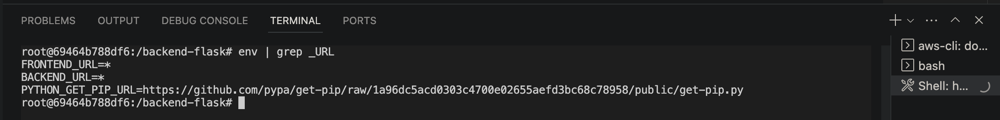

# Week 1 — App Containerization

## Required Homework

### 1. Containerize Application (Dockerfiles, Docker Compose)
Here are the steps I took to containerize the Cruddur application.
I started our by containerizing each of the application

### Steps I followed to containerize Backend-flask
a. I created a `Dockerfile` in `backend-flask` directory

```dockerfile
FROM python:3.10-slim-buster

WORKDIR /backend-flask

COPY requirements.txt requirements.txt
RUN pip3 install -r requirements.txt

COPY . .

ENV FLASK_ENV=development

EXPOSE ${PORT}
CMD [ "python3", "-m" , "flask", "run", "--host=0.0.0.0", "--port=4567"]
```
b. I ran the command below to build `backend-flask` docker image 
 ```sh
 docker build -t  backend-flask ./backend-flask
 ```
 Here is the result showing that a `backend-flask` image has been created
 
 
c. After which I ran the container with the command below

```sh
docker run --rm -p 4567:4567 -it -e FRONTEND_URL='*' -e BACKEND_URL='*' backend-flask
```
This command started the container on port `4567` and set environment variable for `FRONTEND_URL` and `BACKEND_URL` to `*`

Preview container environment variable
 

Preview port container is running on
 
 
 d. I appended `/api/activities/home` to the address url showing in the above port preview and opened it on the browser.
 Here was the the response I received.
  


### Steps I followed to containerize Frontend-React-js

a. I installed the npm packages by running the commands below
```sh
cd frontend-react-js
npm i
```

b. I created a `Dockerfile` in `frontend-react-js` directory

```dockerfile
FROM node:16.18

ENV PORT=3000

COPY . /frontend-react-js
WORKDIR /frontend-react-js
RUN npm install
EXPOSE ${PORT}
CMD ["npm", "start"]
```

c. To build `frontend-react-js` docker image, I navigated to the app root directory using `cd ..` then I ran the command below

 ```sh
 docker build -t frontend-react-js ./frontend-react-js
 ```

d. I started the `frontend-react-js` container on port `3000` with the command below

```sh
docker run -p 3000:3000 -d frontend-react-js
```

Preview of port where the `frontend-react-js` container is running on
 
 
 
 d. I opened the address url running on port 3000 on the browser to preview the application frontend.
 
   

As you could have noticed in the above preview, the `frontend-react-js` has no data from the `backend-flask` This is because both of the containers are not connected yet to communicate with each other.

### Using Docker Compose to Manage Multiple container
Inorder to spin up the containers for `frontend-react-js` and `backend-flask` images at once, I created a `docker-compose.yml` file with content as shown below

```yml
version: "3.8"
services:
  backend-flask:
    environment:
      FRONTEND_URL: "https://3000-${GITPOD_WORKSPACE_ID}.${GITPOD_WORKSPACE_CLUSTER_HOST}"
      BACKEND_URL: "https://4567-${GITPOD_WORKSPACE_ID}.${GITPOD_WORKSPACE_CLUSTER_HOST}"
    build: ./backend-flask
    ports:
      - "4567:4567"
    volumes:
      - ./backend-flask:/backend-flask
  frontend-react-js:
    environment:
      REACT_APP_BACKEND_URL: "https://4567-${GITPOD_WORKSPACE_ID}.${GITPOD_WORKSPACE_CLUSTER_HOST}"
    build: ./frontend-react-js
    ports:
      - "3000:3000"
    volumes:
      - ./frontend-react-js:/frontend-react-js

# the name flag is a hack to change the default prepend folder
# name when outputting the image names
networks: 
  internal-network:
    driver: bridge
    name: cruddur
```

I installed the npm packages required by the `frontend-react-js`
```sh
cd frontend-react-js
npm i
```

On the root directory of the project I executed the command below

```sh
docker compose up
```
Here is the preview of `frontend-react-js` and `backend-flask` containers running on port `3000` and `4567` respectively

 

Here is the preview of the application on the browser
 


### 2. Document the Notification Endpoint for the OpenAI Document 

  Here is my documentation of the notification endpoint in the `openapi-3.0.yml` file
  
  ```yml
    /api/activities/notifications:
    get:
      description: Return of activities for all of those that I follow
      tags:
        - activities
      parameters: []
      responses:
        '200':
          description: Return array of activities
          content:
            application/json:
              schema:
                type: array
                items:
                  $ref: '#/components/schemas/Activity'
  ```
  
  Preview of the Notifications endpoint on swagger editor

   


### 3. Write a Flask Backend Endpoint for Notifications

Here is the preview of my Flask Backend Endpoint Notifications

 

 On my browser, I appended `/api/activities/notifications` to the application URL to recieve the json response on the Notifications api.

 Here is the preview of the response

 


### 4. 	Write a React Page for Notifications

### 5. 	Run DynamoDB Local Container and ensure it works

### 6. Run Postgres Container and ensure it works
