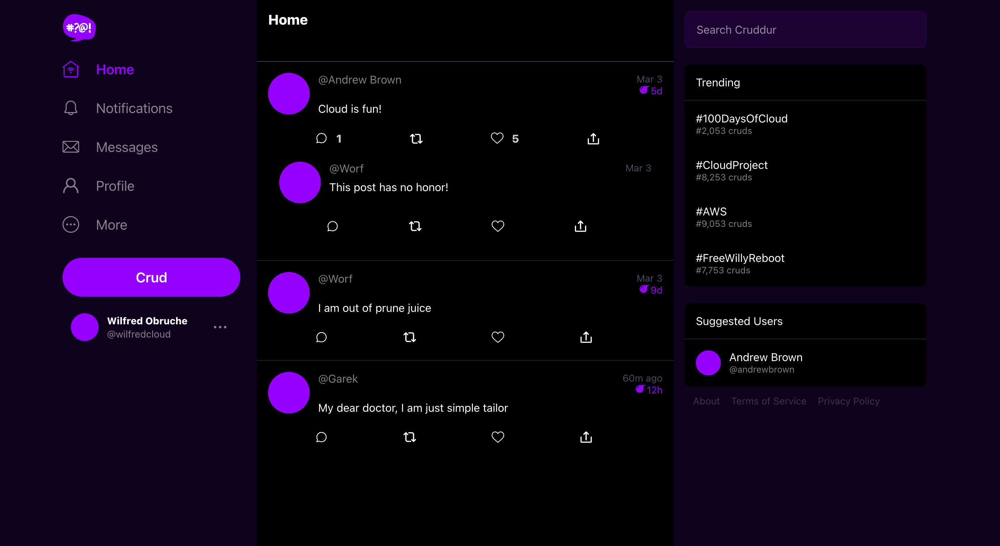

# Week 3 — Decentralized Authentication

### Definintion
Decentralized authentication refers to an authentication process that is based on decentralized systems and technologies. In traditional centralized authentication, users must provide their credentials (such as usernames and passwords) to a central authority (such as a server or service) for verification. This central authority is responsible for managing user authentication and authorizing access to resources.

In contrast, decentralized authentication is based on distributed systems and technologies that allow users to authenticate themselves without relying on a central authority. Instead, authentication is based on cryptographic methods, such as public key cryptography and digital signatures, that provide secure and verifiable authentication without the need for a central authority.

## Required Homework

### 1. Provision via ClickOps a Amazon Cognito User Pool

**Amazon Cognito**
AWS Cognito is a powerful and flexible identity and access management service that enables developers to add user authentication, authorization, and management features to their applications quickly and easily

**User Pools**
Amazon Cognito user pools are a managed service that lets you add secure authentication and authorization to your apps, and can scale to support millions of users.

#### Provision Cognito User Pool
Here is the user pool I created using the AWS console


#### Install AWS Amplify
```sh
cd frontend-react-js
npm i aws-amplify --save
```

#### Configure Amplify
I configured amplify by importing it into my `App.js` and add the configure script below

```js
import { Amplify } from 'aws-amplify';

Amplify.configure({
  "AWS_PROJECT_REGION": process.env.REACT_APP_AWS_PROJECT_REGION,
  "aws_cognito_region": process.env.REACT_APP_AWS_COGNITO_REGION,
  "aws_user_pools_id": process.env.REACT_APP_AWS_USER_POOLS_ID,
  "aws_user_pools_web_client_id": process.env.REACT_APP_AWS_USER_POOLS_CLIENT_ID,
  "oauth": {},
  Auth: {
    // We are not using an Identity Pool
    // identityPoolId: process.env.REACT_APP_IDENTITY_POOL_ID, // REQUIRED - Amazon Cognito Identity Pool ID
    region: process.env.REACT_APP_AWS_PROJECT_REGION,           // REQUIRED - Amazon Cognito Region
    userPoolId: process.env.REACT_APP_AWS_USER_POOLS_ID,         // OPTIONAL - Amazon Cognito User Pool ID
    userPoolWebClientId: process.env.REACT_APP_AWS_USER_POOLS_CLIENT_ID,   // OPTIONAL - Amazon Cognito Web Client ID (26-char alphanumeric string)
  }
});

```

#### Conditionally show components based on logged in or logged out
Inside my `HomeFeedPage.js` I imported `Auth` from `aws-amplify`
```js
import { Auth } from 'aws-amplify';
```

I updated the `checkAuth()` function with the script below
```js
// check if we are authenicated
const checkAuth = async () => {
  Auth.currentAuthenticatedUser({
    // Optional, By default is false. 
    // If set to true, this call will send a 
    // request to Cognito to get the latest user data
    bypassCache: false 
  })
  .then((user) => {
    console.log('user',user);
    return Auth.currentAuthenticatedUser()
  }).then((cognito_user) => {
      setUser({
        display_name: cognito_user.attributes.name,
        handle: cognito_user.attributes.preferred_username
      })
  })
  .catch((err) => console.log(err));
};
```

I confirmed `user` was passed to the  to the following components:
```js
<DesktopNavigation user={user} active={'home'} setPopped={setPopped} />
<DesktopSidebar user={user} />
```

In `ProfileInfo.js` I imported `Auth` from `aws-amplify`
```js
import { Auth } from 'aws-amplify';
```
I updated the `signOut()` function with the script below
```js
const signOut = async () => {
  try {
      await Auth.signOut({ global: true });
      window.location.href = "/"
  } catch (error) {
      console.log('error signing out: ', error);
  }
}
```

In `SigninPage.js` I imported `Auth` from `aws-amplify` and updated the `onsubmit()` function

```js
import { Auth } from 'aws-amplify';


const onsubmit = async (event) => {
    setErrors('')
    event.preventDefault();
      Auth.signIn(email, password)
        .then(user => {
          localStorage.setItem("access_token", user.signInUserSession.accessToken.jwtToken)
          window.location.href = "/"
        })
        .catch(error => {  
          if (error.code == 'UserNotConfirmedException') {
            window.location.href = "/confirm"
          }
        setErrors(error.message)
      });
    return false
  }
  
```
Here is signin page responding with the right error when user email or password is not found or incorrect


To try sigin, I maually created a used from the AWS console and I changed the user's password and updated its confirm status using:

```sh
aws cognito-idp admin-set-user-password \
  --user-pool-id <your-user-pool-id> \
  --username <username> \
  --password <password> \
  --permanent
```


I successfully signed in after confirming user status



Just as I did in `SinginPage.js`, I imported `Auth` from `aws-amplify` and updated the `onsubmit()` function in the `SignupPage.js`
```js
import { Auth } from 'aws-amplify';


const onsubmit = async (event) => {
  event.preventDefault();
  setErrors('')
  try {
      const { user } = await Auth.signUp({
        username: email,
        password: password,
        attributes: {
            name: name,
            email: email,
            preferred_username: username,
        },
        autoSignIn: { // optional - enables auto sign in after user is confirmed
            enabled: true,
        }
      });
      console.log(user);
      window.location.href = `/confirm?email=${email}`
  } catch (error) {
      console.log(error);
      setErrors(error.message)
  }
  return false
}
```

On the `ConfirmationPage.js` I update the `resend_code` and `onsubmit` functions

```js
import { Auth } from 'aws-amplify';


  const resend_code = async (event) => {
    setCognitoErrors('')
    try {
      await Auth.resendSignUp(email);
      console.log('code resent successfully');
      setCodeSent(true)
    } catch (err) {
      // does not return a code
      // does cognito always return english
      // for this to be an okay match?
      console.log(err)
      if (err.message == 'Username cannot be empty'){
        setCognitoErrors("You need to provide an email in order to send Resend Activiation Code")   
      } else if (err.message == "Username/client id combination not found."){
        setCognitoErrors("Email is invalid or cannot be found.")   
      }
    }
  }
  
  const onsubmit = async (event) => {
    event.preventDefault();
    setCognitoErrors('')
    try {
      await Auth.confirmSignUp(email, code);
      window.location.href = "/"
    } catch (error) {
      setCognitoErrors(error.message)
    }
    return false
  }

```

I imported `Auth` from `aws-amplify` and I updated the `onsubmit_send_code` and `onsubmit_confirm_code` functions in   `RecoverPage.js` 

```js
import { Auth } from 'aws-amplify';

  const onsubmit_send_code = async (event) => {
    event.preventDefault();
    setCognitoErrors('')
    Auth.forgotPassword(username)
    .then((data) => setFormState('confirm_code') )
    .catch((err) => setCognitoErrors(err.message) );
    return false
  }
  
  const onsubmit_confirm_code = async (event) => {
    event.preventDefault();
    setCognitoErrors('')
    if (password == passwordAgain){
      Auth.forgotPasswordSubmit(username, code, password)
      .then((data) => setFormState('success'))
      .catch((err) => setCognitoErrors(err.message) );
    } else {
      setCognitoErrors('Passwords do not match')
    }
    return false
  }
```
I noticed a bug in the `ConfirmationPage.js` which I successfully fixed. Andrew Brown made some comment on it in the video. It was about the confirmation email not showing up in email input. The bug was that he use `useParams` instead of `useSearchParams` to get email value from the confirmation url.

Here is the previous code
```js
  const params = useParams();

    React.useEffect(()=>{
    if (params.email) {
      setEmail(params.email)
    }
  }, [])

```

Here is my solution 
```js
  const [searchParams, setSearchParams] = useSearchParams();

    React.useEffect(()=>{
    if (searchParams.get('email')) {
      setEmail(searchParams.get('email'))
    }
  }, [])

```

Confirmation Code Email


Confirmation page


### 2. Install and configure Amplify client-side library for Amazon Congito
### 3. Implement API calls to Amazon Coginto for custom login, signup, recovery and forgot password page
### 4. Show conditional elements and data based on logged in or logged out
### 5. Verify JWT Token server side to serve authenticated API endpoints in Flask Application
