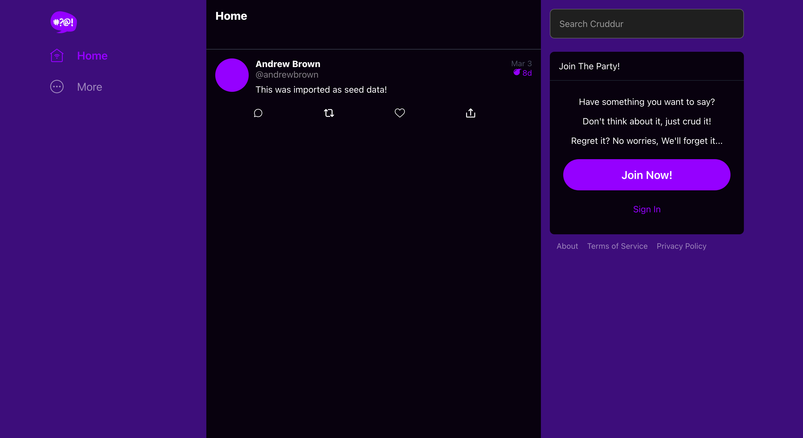
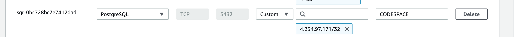
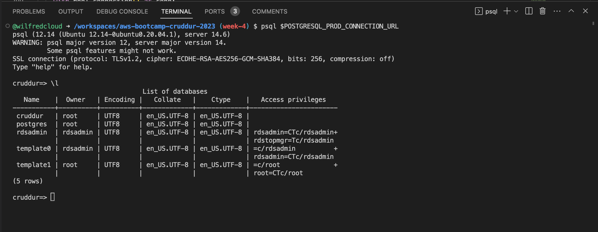
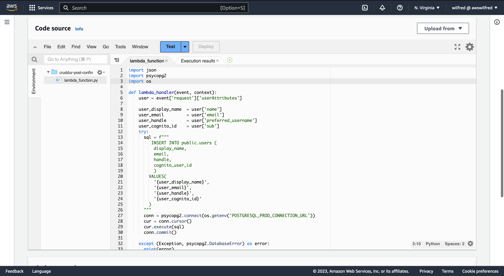
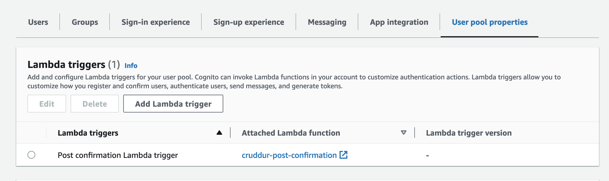
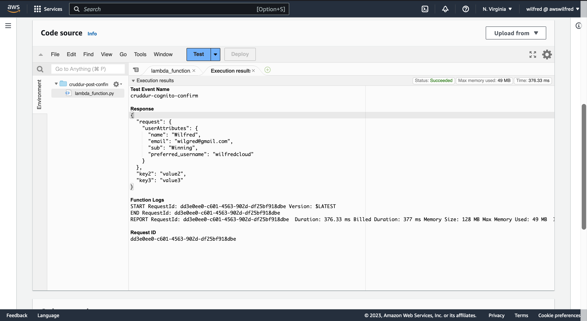
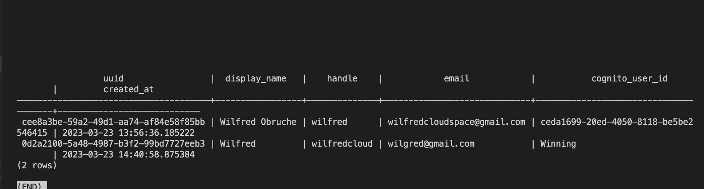
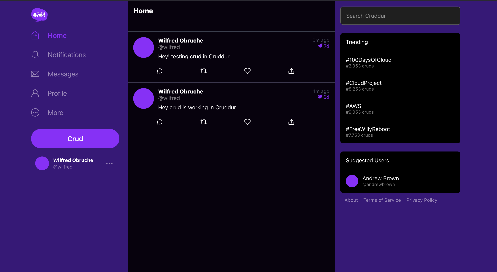

# Week 4 — Postgres and RDS

## Provision RDS Instance

```sh
aws rds create-db-instance \
  --db-instance-identifier cruddur-db-instance \
  --db-instance-class db.t3.micro \
  --engine postgres \
  --engine-version  14.6 \
  --master-username root \
  --master-user-password ******** \
  --allocated-storage 20 \
  --availability-zone us-east-1a \
  --backup-retention-period 0 \
  --port 5432 \
  --no-multi-az \
  --db-name cruddur \
  --storage-type gp2 \
  --publicly-accessible \
  --storage-encrypted \
  --enable-performance-insights \
  --performance-insights-retention-period 7 \
  --no-deletion-protection
```


###     Temporarily stop an RDS instance


### Write several bash scripts for database operations
I created a `bin` folder in the `backend-flask` and added  the following bash scripts for database operations

**Shell script to connect to DB**
`db-connect`
```sh
#!/usr/bin/bash

if ["$1" = "prod"]; then
    echo "RUNNING IN PRODUCTION"
    CONNECTION_URL=$POSTGRESQL_PROD_CONNECTION_URL
else
    echo "RUNNING IN DEVELOPMENT"
    CONNECTION_URL=$POSTGRESQL_CONNECTION_URL
fi

psql $CONNECTION_URL
```

**Shell script to create DB**
`db-create`
```sh
#!/usr/bin/bash

CYAN='\033[1;36m'
NO_COLOR='\033[0m'

LABEL="CREATE CRUDDUR DATABASE"

printf "${CYAN}${LABEL}${NO_COLOR}\n"

DB_CONNECTION_URL=$(sed 's/\/cruddur//g' <<< "$POSTGRESQL_CONNECTION_URL")
psql $DB_CONNECTION_URL -c "CREATE DATABASE cruddur;"
```

**Shell script to drop to DB**
`dp-drop`

```sh
#!/usr/bin/bash 
echo "DROP CRUDDUR DATABASE"
DB_CONNECTION_URL=$(sed 's/\/cruddur//g' <<< "$POSTGRESQL_CONNECTION_URL")
psql $DB_CONNECTION_URL -c "DROP DATABASE cruddur;"
```
**Shell script to load schema into database**
`db-schema-load`
```sh
LABEL="DATABASE SCHEMA LOAD"

printf "${CYAN}${LABEL}${NO_COLOR}\n"

SCHEMA_PATH=$(realpath .)/db/schema.sql

if ["$1" = "prod"]; then
    echo "RUNNING IN PRODUCTION"
    CONNECTION_URL=$POSTGRESQL_PROD_CONNECTION_URL
else
    echo "RUNNING IN DEVELOPMENT"
    CONNECTION_URL=$POSTGRESQL_CONNECTION_URL
fi

psql $CONNECTION_URL cruddur < $SCHEMA_PATH
```

**Shell script to seed schema**
`db-seed`

```sh
#!/usr/bin/bash

CYAN='\033[1;36m'
NO_COLOR='\033[0m'

LABEL="DATABASE SEED"

printf "${CYAN}${LABEL}${NO_COLOR}\n"

SEED_PATH=$(realpath .)/db/seed.sql

CONNECTION_URL=$POSTGRESQL_CONNECTION_URL

if ["$1" = "prod"]; then
    echo "USING PRODUCTION URL"
    CONNECTION_URL=$POSTGRESQL_PROD_CONNECTION_URL
else
    echo "USING DEVELOPMENT URL"
fi
psql $CONNECTION_URL cruddur < $SEED_PATH

```

**Show all current db connections**
```sh
#!/usr/bin/bash

CYAN='\033[1;36m'
NO_COLOR='\033[0m'

LABEL="SHOW ALL DB CONNECTIONS"

printf "${CYAN}${LABEL}${NO_COLOR}\n"

if ["$1" = "prod"]; then
    echo "RUNNING IN PRODUCTION"
    CONNECTION_URL=$POSTGRESQL_PROD_CONNECTION_URL
else
    echo "RUNNING IN DEVELOPMENT"
    CONNECTION_URL=$POSTGRESQL_CONNECTION_URL
fi

NO_DB_CONNECTION_URL=$(sed 's/\/cruddur//g' <<<"$CONNECTION_URL")
psql $NO_DB_CONNECTION_URL -c "select pid as process_id, \
       usename as user,  \
       datname as db, \
       client_addr, \
       application_name as app,\
       state \
from pg_stat_activity;"
```

**Setup Database**
`db-setup`
```sh
#!/usr/bin/bash
-e

CYAN='\033[1;36m'
NO_COLOR='\033[0m'

LABEL="SHOW ALL DB CONNECTIONS"

printf "${CYAN}${LABEL}${NO_COLOR}\n"

BIN_PATH=$(realpath .)/bin

source "$BIN_PATH/db-drop"
source "$BIN_PATH/db-create"
source "$BIN_PATH/db-schema-load"
source "$BIN_PATH/db-seed"
```


### Operate common SQL commands

**I connected to postgresql with**

```sh
psql -Upostgres --host localhost
```
In the postgresql interpreter I ran the following commands
```sh
\l # -- List all database
\c <dbname> # -- Connect to a specific database
\dt # -- List current database tables
\d <table_name> # -- Describe a specific table 
\dn # -- List all schemas in the current database
\du # -- List all users and their roles
CREATE DATABASE database_name; -- Create a new database
DROP DATABASE database_name; -- Delete a database
\q # -- Quit psql
```


I connect to `cruddur` database with postgres db explorer  


### Work with UUIDs and PSQL extensions
Added UUID to PSQL
```psql
CREATE EXTENSION IF NOT EXISTS "uuid-ossp";
```

### Create a schema SQL file by hand

Here i my SLQ schema file in `backend-flask\db`
`schema.sql`
```sql
CREATE EXTENSION IF NOT EXISTS "uuid-ossp";

DROP TABLE IF EXISTS public.users;

DROP TABLE IF EXISTS public.activities;

CREATE TABLE public.users (
  uuid UUID DEFAULT uuid_generate_v4() PRIMARY KEY,
  display_name text,
  handle text,
  cognito_user_id text,
  created_at TIMESTAMP default current_timestamp NOT NULL
);


CREATE TABLE public.activities (
  uuid UUID DEFAULT uuid_generate_v4() PRIMARY KEY,
  user_uuid UUID NOT NULL,
  message text NOT NULL,
  replies_count integer DEFAULT 0,
  reposts_count integer DEFAULT 0,
  likes_count integer DEFAULT 0,
  reply_to_activity_uuid integer,
  expires_at TIMESTAMP,
  created_at TIMESTAMP default current_timestamp NOT NULL
);
```

### Implement a postgres client for python using a connection pool

First I added the postgress client to `requirement.txt`
```py
psycopg[binary]
psycopg[pool]
``` 

I created `lib/db.py` create connection pool

```py
from psycopg_pool import ConnectionPool
import os

def query_wrap_object(template):
  sql = f"""
  (SELECT COALESCE(row_to_json(object_row),'{{}}'::json) FROM (
  {template}
  ) object_row);
  """
  return sql

def query_wrap_array(template):
  sql = f"""
  (SELECT COALESCE(array_to_json(array_agg(row_to_json(array_row))),'[]'::json) FROM (
  {template}
  ) array_row);
  """
  return sql

connection_url = os.getenv("POSTGRESQL_CONNECTION_URL")
connection_url = "postgresql://postgres:password@db:5432/cruddur"
pool = ConnectionPool(connection_url)
```

Finally I updated `home_activities.py` to query and return data from the database

```py
class HomeActivities:
  def run(cognito_user_id=None):
    #logger.info("HomeActivities")
    sql = query_wrap_array("""
      SELECT
        activities.uuid,
        users.display_name,
        users.handle,
        activities.message,
        activities.replies_count,
        activities.reposts_count,
        activities.likes_count,
        activities.reply_to_activity_uuid,
        activities.expires_at,
        activities.created_at
      FROM public.activities
      LEFT JOIN public.users ON users.uuid = activities.user_uuid
      ORDER BY activities.created_at DESC
    """)

    with pool.connection() as conn:
      with conn.cursor() as cur:
        cur.execute(sql)
        # this will return a tuple
        # the first field being the data
        json = cur.fetchone()
    return json[0]
```

Here is the return on the website



### Remotely connect to RDS instance
To connect to my RDS postgresql instance, I did following
- I started the instance
- Added a new inbound security group to it to allow my Codespace IP address
- I connected to the instance using `psql` command and the connection url.

RDS Security Group Rule


RDS Instance Connection


Programmatically update a security group rule
I created the bash script below in `backend-flask\bin\rds-security-rule` to programmatically update my security group rules

```sh
#!/usr/bin/bash

CYAN='\033[1;36m'
NO_COLOR='\033[0m'

LABEL="UPDATE RDS SECURITY GROUP RULES"

printf "${CYAN}${LABEL}${NO_COLOR}\n"

aws ec2 modify-security-group-rules \
 --group-id $DB_SECURITY_GROUP_ID \
 --security-group-rules "SecurityGroupRuleId=$DB_SECURITY_GROUP_RULE_ID,SecurityGroupRule={Description=CODESPACE, IpProtocol=tcp,FromPort=5432,ToPort=5432,CidrIpv4=$CODESPACE_IP/32}"
```

### Troubleshoot common SQL errors
I troubleshot commons SQL errors and fixed it 


### Implement a Lambda that runs in a VPC and commits code to RDS
I successfully implemented the Lambda function following these step.

- First in `aws/lambda/cruddur-post-confirrmation.py` I created the python script below for the lambda function
```py
import json
import psycopg2
import os

def lambda_handler(event, context):
    user = event['request']['userAttributes']

    user_display_name  = user['name']
    user_email         = user['email']
    user_handle        = user['preferred_username']
    user_cognito_id    = user['sub']
    try:
      sql = f"""
         INSERT INTO public.users (
          display_name, 
          email,
          handle, 
          cognito_user_id
          ) 
        VALUES(
          '{user_display_name}', 
          '{user_email}', 
          '{user_handle}', 
          '{user_cognito_id}'
        )
      """
      conn = psycopg2.connect(os.getenv('POSTGRESQL_PROD_CONNECTION_URL'))
      cur = conn.cursor()
      cur.execute(sql)
      conn.commit() 

    except (Exception, psycopg2.DatabaseError) as error:
      print(error)
    finally:
      if conn is not None:
          cur.close()
          conn.close()
    return event
```

- On my AWS console, I create a lambda function with the following properties
  - Function name: **cruddur-post-confirmation**
  - Runtime: **Python 3.8**
  - Architecture: x86_64

- On the lamdba function code source and paste the python snippet on `aws/lambda/cruddur-post-confirrmation.py` as show above



- I added the `psycopg2-lambda-layer` for my region `us-east-1` for `Python 3.8`

`arn:aws:lambda:us-east-1:898466741470:layer:psycopg2-py38:2`

- I added `POSTGRESQL_PROD_CONNECTION_URL` to the environment variable

- I added `cruddur-post-confirmation` lambda function to `cruddur-user-pool`  lambda trigger user pool properties so that cognito will trigger it



- Then I edited the `cruddur-post-confirmation` lambda `VCP` and added it to `RDS` instance `security group`

- I I wrote a test for the function, confirm it work then I deployed it.



Here is the result showing my lambda test and cruddur signup.





Work with PSQL json functions to directly return json from the database 

```py

  def query_wrap_object(self,template):
    sql = f"""
    (SELECT COALESCE(row_to_json(object_row),'{{}}'::json) FROM (
    {template}
    ) object_row);
    """
    return sql
  def query_wrap_array(self,template):
    sql = f"""
    (SELECT COALESCE(array_to_json(array_agg(row_to_json(array_row))),'[]'::json) FROM (
    {template}
    ) array_row);
    """

```


Correctly sanitize parameters passed to SQL to execute 

I used parameterized queries, which can help prevent SQL injection attacks.
here is an example.
```py
INSERT INTO public.activities (
  user_uuid,
  message,
  expires_at
)
VALUES (
  (SELECT uuid 
    FROM public.users 
    WHERE users.handle = %(handle)s
    LIMIT 1
  ),
  %(message)s,
  %(expires_at)s
) RETURNING uuid;
```

At the end of week 4, Crud was working 


