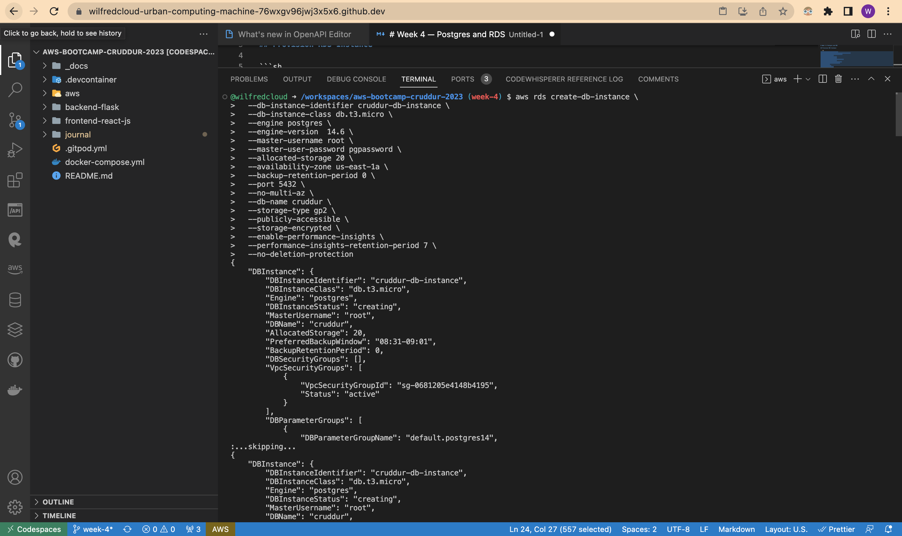
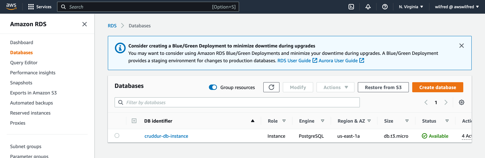
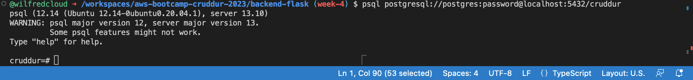

# Week 4 — Postgres and RDS

## Provision RDS Instance

```sh
aws rds create-db-instance \
  --db-instance-identifier cruddur-db-instance \
  --db-instance-class db.t3.micro \
  --engine postgres \
  --engine-version  14.6 \
  --master-username root \
  --master-user-password ******** \
  --allocated-storage 20 \
  --availability-zone us-east-1a \
  --backup-retention-period 0 \
  --port 5432 \
  --no-multi-az \
  --db-name cruddur \
  --storage-type gp2 \
  --publicly-accessible \
  --storage-encrypted \
  --enable-performance-insights \
  --performance-insights-retention-period 7 \
  --no-deletion-protection
```





I connected to postgres with connection url




    Provision an RDS instance
    Temporarily stop an RDS instance
    Remotely connect to RDS instance
    Programmatically update a security group rule
    Write several bash scripts for database operations
    Operate common SQL commands
    Create a schema SQL file by hand
    Work with UUIDs and PSQL extensions
    Implement a postgres client for python using a connection pool
    Troubleshoot common SQL errors
    Implement a Lambda that runs in a VPC and commits code to RDS
    Work with PSQL json functions to directly return json from the database
    Correctly sanitize parameters passed to SQL to execute
