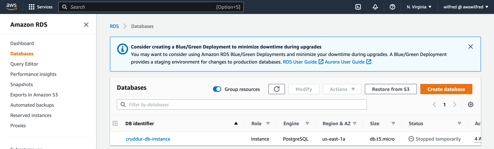
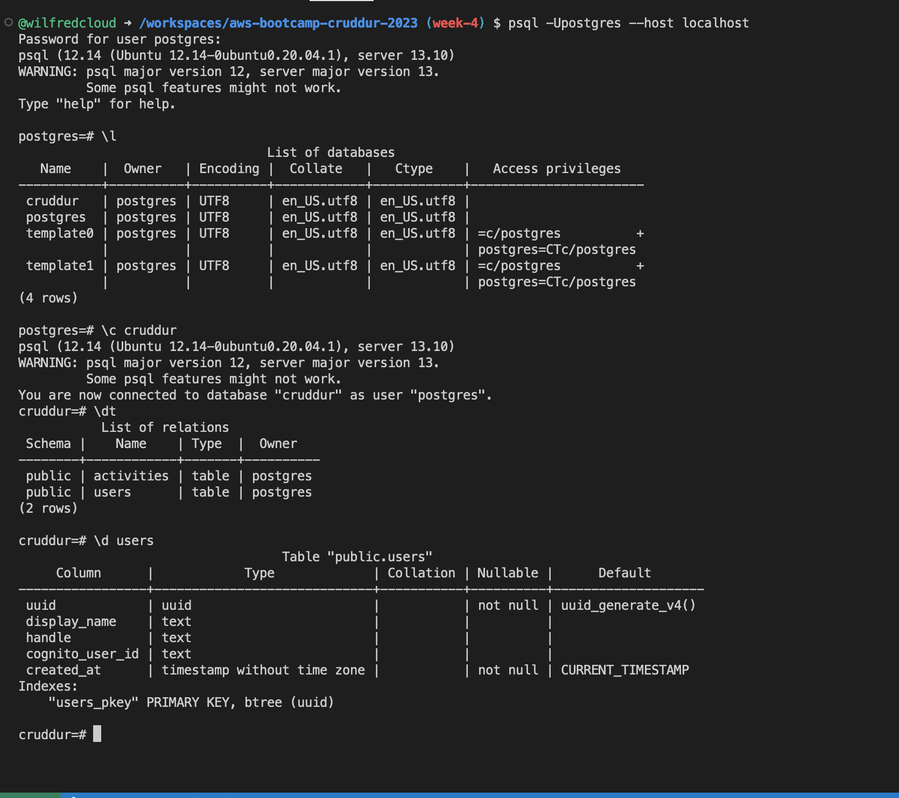
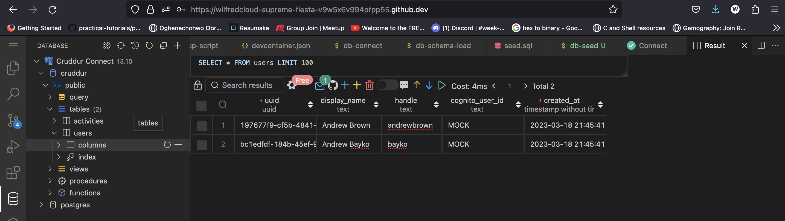

# Week 4 — Postgres and RDS

## Provision RDS Instance

```sh
aws rds create-db-instance \
  --db-instance-identifier cruddur-db-instance \
  --db-instance-class db.t3.micro \
  --engine postgres \
  --engine-version  14.6 \
  --master-username root \
  --master-user-password ******** \
  --allocated-storage 20 \
  --availability-zone us-east-1a \
  --backup-retention-period 0 \
  --port 5432 \
  --no-multi-az \
  --db-name cruddur \
  --storage-type gp2 \
  --publicly-accessible \
  --storage-encrypted \
  --enable-performance-insights \
  --performance-insights-retention-period 7 \
  --no-deletion-protection
```


###     Temporarily stop an RDS instance




### Write several bash scripts for database operations
I created a `bin` folder in the `backend-flask` and added  the following bash scripts for database operations

**Shell script to connect to DB**
`db-connect`
```sh
#!/usr/bin/bash

if ["$1" = "prod"]; then
    echo "RUNNING IN PRODUCTION"
    CONNECTION_URL=$POSTGRESQL_PROD_CONNECTION_URL
else
    echo "RUNNING IN DEVELOPMENT"
    CONNECTION_URL=$POSTGRESQL_CONNECTION_URL
fi

psql $CONNECTION_URL
```

**Shell script to create DB**
`db-create`
```sh
#!/usr/bin/bash

CYAN='\033[1;36m'
NO_COLOR='\033[0m'

LABEL="CREATE CRUDDUR DATABASE"

printf "${CYAN}${LABEL}${NO_COLOR}\n"

DB_CONNECTION_URL=$(sed 's/\/cruddur//g' <<< "$POSTGRESQL_CONNECTION_URL")
psql $DB_CONNECTION_URL -c "CREATE DATABASE cruddur;"
```

**Shell script to drop to DB**
`dp-drop`

```sh
#!/usr/bin/bash 
echo "DROP CRUDDUR DATABASE"
DB_CONNECTION_URL=$(sed 's/\/cruddur//g' <<< "$POSTGRESQL_CONNECTION_URL")
psql $DB_CONNECTION_URL -c "DROP DATABASE cruddur;"
```
**Shell script to load schema into database**
`db-schema-load`
```sh
LABEL="DATABASE SCHEMA LOAD"

printf "${CYAN}${LABEL}${NO_COLOR}\n"

SCHEMA_PATH=$(realpath .)/db/schema.sql

if ["$1" = "prod"]; then
    echo "RUNNING IN PRODUCTION"
    CONNECTION_URL=$POSTGRESQL_PROD_CONNECTION_URL
else
    echo "RUNNING IN DEVELOPMENT"
    CONNECTION_URL=$POSTGRESQL_CONNECTION_URL
fi

psql $CONNECTION_URL cruddur < $SCHEMA_PATH
```

**Shell script to seed schema**
`db-seed`

```sh
#!/usr/bin/bash

CYAN='\033[1;36m'
NO_COLOR='\033[0m'

LABEL="DATABASE SEED"

printf "${CYAN}${LABEL}${NO_COLOR}\n"

SEED_PATH=$(realpath .)/db/seed.sql

CONNECTION_URL=$POSTGRESQL_CONNECTION_URL

if ["$1" = "prod"]; then
    echo "USING PRODUCTION URL"
    CONNECTION_URL=$POSTGRESQL_PROD_CONNECTION_URL
else
    echo "USING DEVELOPMENT URL"
fi
psql $CONNECTION_URL cruddur < $SEED_PATH

```

**Show all current db connections**
```sh
#!/usr/bin/bash

CYAN='\033[1;36m'
NO_COLOR='\033[0m'

LABEL="SHOW ALL DB CONNECTIONS"

printf "${CYAN}${LABEL}${NO_COLOR}\n"

if ["$1" = "prod"]; then
    echo "RUNNING IN PRODUCTION"
    CONNECTION_URL=$POSTGRESQL_PROD_CONNECTION_URL
else
    echo "RUNNING IN DEVELOPMENT"
    CONNECTION_URL=$POSTGRESQL_CONNECTION_URL
fi

NO_DB_CONNECTION_URL=$(sed 's/\/cruddur//g' <<<"$CONNECTION_URL")
psql $NO_DB_CONNECTION_URL -c "select pid as process_id, \
       usename as user,  \
       datname as db, \
       client_addr, \
       application_name as app,\
       state \
from pg_stat_activity;"
```

**Setup Database**
```sh
#!/usr/bin/bash
```


### Operate common SQL commands

**I connected to postgresql with**

```sh
psql -Upostgres --host localhost
```
In the postgresql interpreter I ran the following commands
```sh
\l # -- List all database
\c <dbname> # -- Connect to a specific database
\dt # -- List current database tables
\d <table_name> # -- Describe a specific table 
\dn # -- List all schemas in the current database
\du # -- List all users and their roles
CREATE DATABASE database_name; -- Create a new database
DROP DATABASE database_name; -- Delete a database
\q # -- Quit psql
```


I connect to `cruddur` database with postgres db explorer  



### Work with UUIDs and PSQL extensions
Added UUID to PSQL
```psql
CREATE EXTENSION IF NOT EXISTS "uuid-ossp";
```

### Create a schema SQL file by hand

Here i my SLQ schema file in `backend-flask\db`
`schema.sql`
```sql
CREATE EXTENSION IF NOT EXISTS "uuid-ossp";

DROP TABLE IF EXISTS public.users;

DROP TABLE IF EXISTS public.activities;

CREATE TABLE public.users (
  uuid UUID DEFAULT uuid_generate_v4() PRIMARY KEY,
  display_name text,
  handle text,
  cognito_user_id text,
  created_at TIMESTAMP default current_timestamp NOT NULL
);


CREATE TABLE public.activities (
  uuid UUID DEFAULT uuid_generate_v4() PRIMARY KEY,
  user_uuid UUID NOT NULL,
  message text NOT NULL,
  replies_count integer DEFAULT 0,
  reposts_count integer DEFAULT 0,
  likes_count integer DEFAULT 0,
  reply_to_activity_uuid integer,
  expires_at TIMESTAMP,
  created_at TIMESTAMP default current_timestamp NOT NULL
);
```


    Remotely connect to RDS instance
    Programmatically update a security group rule
    Implement a postgres client for python using a connection pool
    Troubleshoot common SQL errors
    Implement a Lambda that runs in a VPC and commits code to RDS
    Work with PSQL json functions to directly return json from the database
    Correctly sanitize parameters passed to SQL to execute
