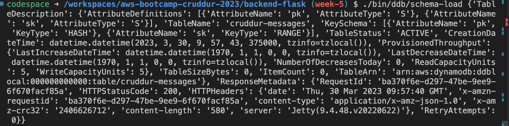
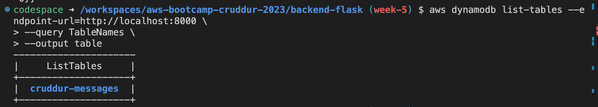
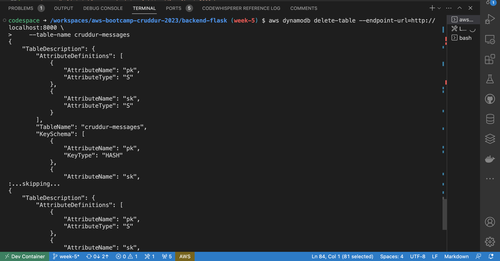
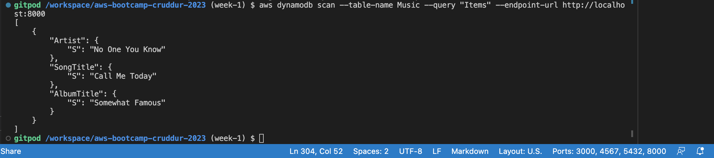
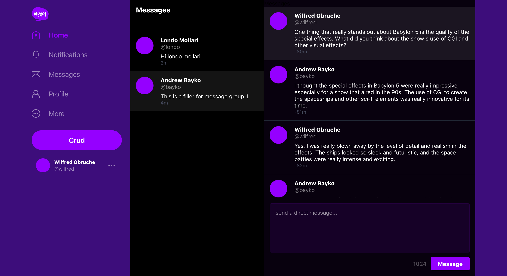
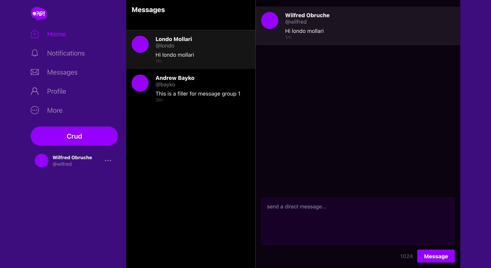
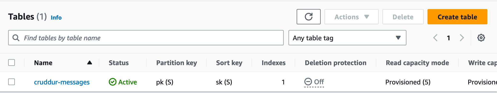
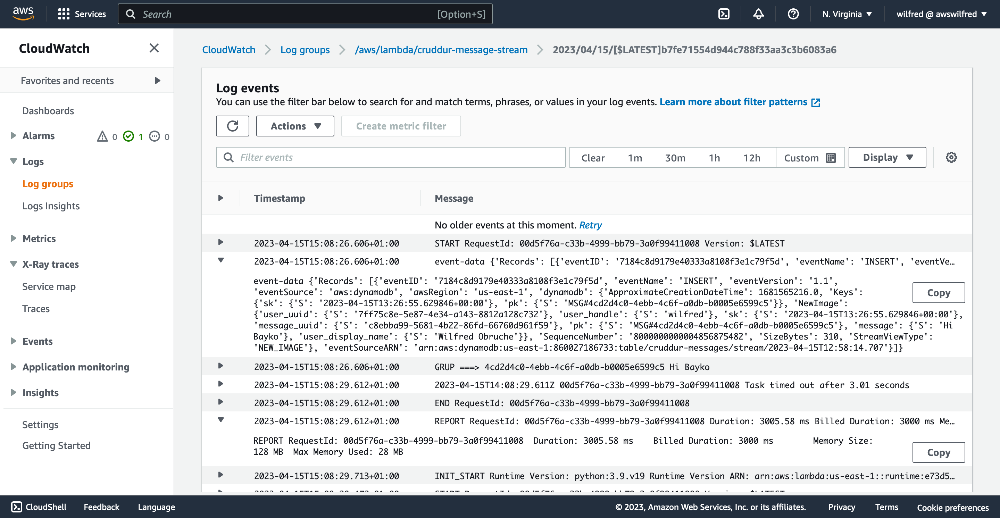
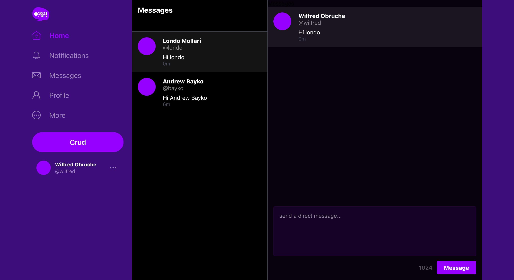

# Week 5 — DynamoDB and Serverless Caching

## Required Home Work

  Data Modelling a Direct Messaging System using Single Table Design
Dynamodb Schema load CLI response


### Provisioning DynamoDB tables with Provisioned Capacity

Using boto3 client, I created `cruddur-messages` in dynamodb with provisioned capacity

```py
#!/usr/bin/env python3

import boto3
import sys

attrs = {
  'endpoint_url': 'http://localhost:8000'
}

if len(sys.argv) == 2:
  if "prod" in sys.argv[1]:
    attrs = {}

ddb = boto3.client('dynamodb',**attrs)

table_name = 'cruddur-messages'


response = ddb.create_table(
  TableName=table_name,
  AttributeDefinitions=[
    {
      'AttributeName': 'pk',
      'AttributeType': 'S'
    },
    {
      'AttributeName': 'sk',
      'AttributeType': 'S'
    },
  ],
  KeySchema=[
    {
      'AttributeName': 'pk',
      'KeyType': 'HASH'
    },
    {
      'AttributeName': 'sk',
      'KeyType': 'RANGE'
    },
  ],
  #GlobalSecondaryIndexes=[
  #],
  BillingMode='PROVISIONED',
  ProvisionedThroughput={
      'ReadCapacityUnits': 5,
      'WriteCapacityUnits': 5
  }
)

print(response) 
```




###   Implementing DynamoDB query using Single Table Design

I implemented the follow dynamodb query

- List Tables using the aws cli
```sh
aws dynamodb list-tables --endpoint-url=http://localhost:8000 \
--query TableNames \
--output table
```



- Drop table using the aws cli
```sh
aws dynamodb delete-table --endpoint-url=http://localhost:8000 \
    --table-name cruddur-messages
```



- I scanned table using boto3 sdk

```py
#!/usr/bin/env python3

import boto3

attrs = {
  'endpoint_url': 'http://localhost:8000'
}
ddb = boto3.resource('dynamodb',**attrs)
table_name = 'cruddur-messages'

table = ddb.Table(table_name)
response = table.scan()

items = response['Items']
for item in items:
  print(item)
```



###  Writing utility scripts to easily setup and teardown and debug DynamoDB data
I wrote the following scrits to setup dynamodb

- Create Dynamo DB table
```sh
#!/usr/bin/bash

CYAN='\033[1;36m'
NO_COLOR='\033[0m'

LABEL="DATABASE SCHEMA LOAD"

printf "${CYAN}${LABEL}${NO_COLOR}\n"

SCHEMA_PATH=$(realpath .)/db/schema.sql

if [ "$1" = "prod" ]; then
    echo "RUNNING IN PRODUCTION"
    CONNECTION_URL=$POSTGRESQL_PROD_CONNECTION_URL
else
    echo "RUNNING IN DEVELOPMENT"
    CONNECTION_URL=$POSTGRESQL_CONNECTION_URL
fi

psql $CONNECTION_URL cruddur < $SCHEMA_PATH
```

- Seed the table with conversation data
- Drop the table
- List tables
- Query the table to list conversations
- Query the table to get conversation

Show preloaded conversation


Show newly created conversation



## Implement Dynamodb Stream
I created a dynamodb table and turned on DynamoDB stream.



Created a Dynamodb trigger to call to invoke an AWS Lambda function every time an item is changed, and  DynamoDB stream is updated.

```py
import json
import boto3
from boto3.dynamodb.conditions import Key, Attr

dynamodb = boto3.resource(
 'dynamodb',
 region_name='us-east-1',
 endpoint_url="http://dynamodb.us-east-1.amazonaws.com"
)

def lambda_handler(event, context):
  print('event-data',event)

  eventName = event['Records'][0]['eventName']
  if (eventName == 'REMOVE'):
    print("skip REMOVE event")
    return
  pk = event['Records'][0]['dynamodb']['Keys']['pk']['S']
  sk = event['Records'][0]['dynamodb']['Keys']['sk']['S']
  if pk.startswith('MSG#'):
    group_uuid = pk.replace("MSG#","")
    message = event['Records'][0]['dynamodb']['NewImage']['message']['S']
    print("GRUP ===>",group_uuid,message)

    table_name = 'cruddur-messages'
    index_name = 'message-group-sk-index'
    table = dynamodb.Table(table_name)
    data = table.query(
      IndexName=index_name,
      KeyConditionExpression=Key('message_group_uuid').eq(group_uuid)
    )
    print("RESP ===>",data['Items'])

    # recreate the message group rows with new SK value
    for i in data['Items']:
      delete_item = table.delete_item(Key={'pk': i['pk'], 'sk': i['sk']})
      print("DELETE ===>",delete_item)

      response = table.put_item(
        Item={
          'pk': i['pk'],
          'sk': sk,
          'message_group_uuid':i['message_group_uuid'],
          'message':message,
          'user_display_name': i['user_display_name'],
          'user_handle': i['user_handle'],
          'user_uuid': i['user_uuid']
        }
      )
      print("CREATE ===>",response)
```
Dynamodb trigger logs



Dynamodb working


  

