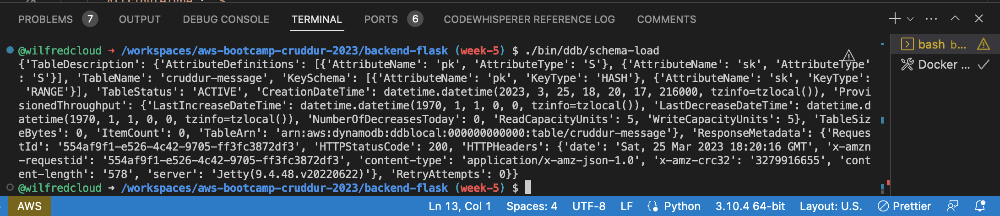

# Week 5 — DynamoDB and Serverless Caching

## Required Home Work

  Data Modelling a Direct Messaging System using Single Table Design
Dynamodb Schema load CLI response



### Provisioning DynamoDB tables with Provisioned Capacity

Using boto3 client, I created `cruddur-messages` in dynamodb with provisioned capacity

```py
#!/usr/bin/env python3

import boto3
import sys

attrs = {
  'endpoint_url': 'http://localhost:8000'
}

if len(sys.argv) == 2:
  if "prod" in sys.argv[1]:
    attrs = {}

ddb = boto3.client('dynamodb',**attrs)

table_name = 'cruddur-messages'


response = ddb.create_table(
  TableName=table_name,
  AttributeDefinitions=[
    {
      'AttributeName': 'pk',
      'AttributeType': 'S'
    },
    {
      'AttributeName': 'sk',
      'AttributeType': 'S'
    },
  ],
  KeySchema=[
    {
      'AttributeName': 'pk',
      'KeyType': 'HASH'
    },
    {
      'AttributeName': 'sk',
      'KeyType': 'RANGE'
    },
  ],
  #GlobalSecondaryIndexes=[
  #],
  BillingMode='PROVISIONED',
  ProvisionedThroughput={
      'ReadCapacityUnits': 5,
      'WriteCapacityUnits': 5
  }
)

print(response) 
```


###   Implementing DynamoDB query using Single Table Design

I implemented the follow dynamodb query

- List Tables using the aws cli
```sh
aws dynamodb list-tables --endpoint-url=http://localhost:8000 \
--query TableNames \
--output table
```

- Drop table using the aws cli
```sh
aws dynamodb delete-table --endpoint-url=http://localhost:8000 \
    --table-name cruddur-messages
```

- I scan thte table


  
    Utilizing a Global Secondary Index (GSI) with DynamoDB
    Rapid data modelling and implementation of DynamoDB with DynamoDB Local
    Writing utility scripts to easily setup and teardown and debug DynamoDB data
