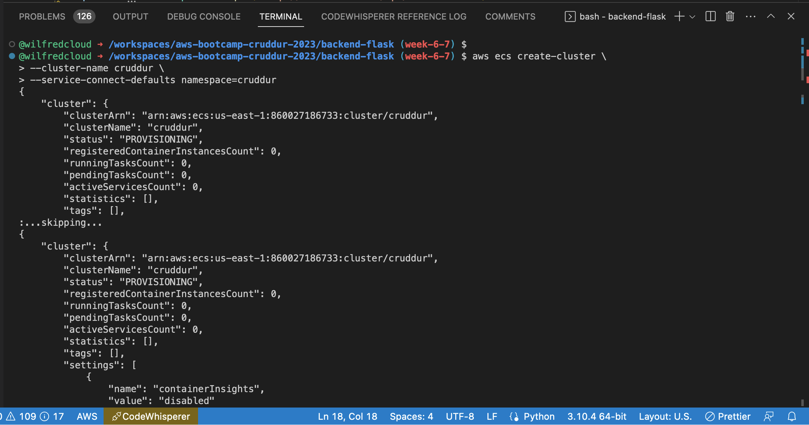
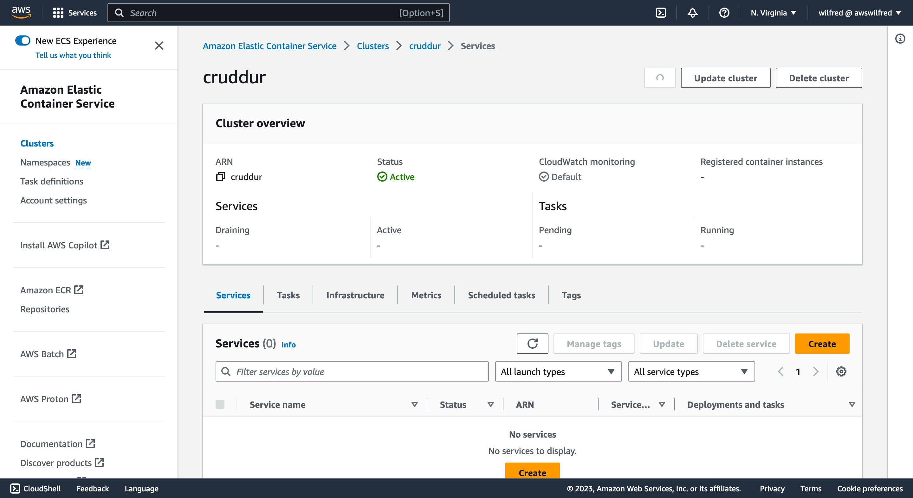

# Week 6 — Deploying Containers


## Required Homework

### Deploy an ECS Cluster using ECS Service Connect

I ran the command below on the aws cli to create ECS cluster name cruddur
```sh
aws ecs create-cluster \
--cluster-name cruddur \
--service-connect-defaults namespace=cruddur
```





### Deploy serverless containers using Fargate for the Backend and Frontend Application

Logined in to ECR on aws cli using
```sh
aws ecr get-login-password --region $AWS_DEFAULT_REGION | docker login --username AWS --password-stdin "$AWS_ACCOUNT_ID.dkr.ecr.$AWS_DEFAULT_REGION.amazonaws.com"
```
I created an ECR (Elastic Container Registery) Reposittory
- backend-flask
```sh
aws ecr create-repository \
  --repository-name backend-flask \
  --image-tag-mutability MUTABLE
```
- Frontend-react-js
```sh
aws ecr create-repository \
  --repository-name frontend-react-js \
  --image-tag-mutability MUTABLE
```
- cruddur-python
```sh
aws ecr create-repository \
  --repository-name cruddur-python \
  --image-tag-mutability MUTABLE
```

Build docker images
- backend-flask
```sh
docker build -t backend-flask .
```
- Frontend-react-js
```sh
docker build \
--build-arg REACT_APP_BACKEND_URL="http://cruddur-alb-1591977895.us-east-1.elb.amazonaws.com:4567" \
--build-arg REACT_APP_AWS_PROJECT_REGION="$AWS_DEFAULT_REGION" \
--build-arg REACT_APP_AWS_COGNITO_REGION="$AWS_DEFAULT_REGION" \
--build-arg REACT_APP_AWS_USER_POOLS_ID="$AWS_COGNITO_USER_POOL_ID" \
--build-arg REACT_APP_CLIENT_ID="$AWS_COGNITO_USER_POOL_CLIENT_ID" \
-t frontend-react-js \
-f Dockerfile.prod \
.
```
- Set ECR URL
```sh
export ECR_BACKEND_FLASK_URL="$AWS_ACCOUNT_ID.dkr.ecr.$AWS_DEFAULT_REGION.amazonaws.com/backend-flask"
echo $ECR_BACKEND_FLASK_URL
```

Tagged and pushed Images to ECR repo.
- backend-flask
```sh
docker tag backend-flask:latest $ECR_BACKEND_FLASK_URL:latest
docker push $ECR_BACKEND_FLASK_URL:latest
```
- Frontend-react-js
```sh
docker tag frontend-react-js:latest $ECR_FRONTEND_REACT_URL:latest
docker push $ECR_FRONTEND_REACT_URL:latest
```
#### Register Task Defintions
To register task definition for backend-flask and frontend-react-js
- I created `CruddurServiceExecutionRole` and added `CruddurServiceExecutionPolicy`

```json
{
    "Version": "2012-10-17",
    "Statement": [
        {
            "Sid": "VisualEditor0",
            "Effect": "Allow",
            "Action": [
                "ecr:GetAuthorizationToken",
                "ecr:BatchCheckLayerAvailability",
                "ecr:GetDownloadUrlForLayer",
                "ecr:BatchGetImage",
                "logs:CreateLogStream",
                "logs:PutLogEvents"
            ],
            "Resource": "*"
        },
        {
            "Sid": "VisualEditor1",
            "Effect": "Allow",
            "Action": [
                "ssm:GetParameters",
                "ssm:GetParameter"
            ],
            "Resource": "arn:aws:ssm:us-east-1:860027186733:parameter/cruddur/backend-flask/*"
        }
    ]
}
```
- I also created `CruddurTaskRole` and added the following policies
  -  CloudWatchFullAccess
  -  AWSXRayDaemonWriteAccess
  -  SSMAccessPolicy

- Inorder to securely pass sensitive data to the task definition, I stored the values of the data in the paramenter stores
```sh
aws ssm put-parameter --type "SecureString" --name "/cruddur/backend-flask/AWS_ACCESS_KEY_ID" --value $AWS_ACCESS_KEY_ID
aws ssm put-parameter --type "SecureString" --name "/cruddur/backend-flask/AWS_SECRET_ACCESS_KEY" --value $AWS_SECRET_ACCESS_KEY
aws ssm put-parameter --type "SecureString" --name "/cruddur/backend-flask/CONNECTION_URL" --value $PROD_CONNECTION_URL
aws ssm put-parameter --type "SecureString" --name "/cruddur/backend-flask/ROLLBAR_ACCESS_TOKEN" --value $ROLLBAR_ACCESS_TOKEN
aws ssm put-parameter --type "SecureString" --name "/cruddur/backend-flask/OTEL_EXPORTER_OTLP_HEADERS" --value "x-honeycomb-team=$HONEYCOMB_API_KEY"
```

Here is my JSON file for 

### Route traffic to the frontend and backend on different subdomains using Application Load Balancer
### Securing our flask container


### Creating several bash utility scripts to easily work with serverless containers.

#### RDS connection Test
Because PosgreSQL (PSQL) command will not be installed in the container, I created a python script to test RDS Posgres connection.
```
#!/usr/bin/env python3

import psycopg
import os
import sys

connection_url = os.getenv("POSTGRESQL_PROD_CONNECTION_URL")

conn = None
try:
  print('attempting connection')
  conn = psycopg.connect(connection_url)
  print("Connection successful!")
except psycopg.Error as e:
  print("Unable to connect to the database:", e)
finally:
  conn.close()
 ```


