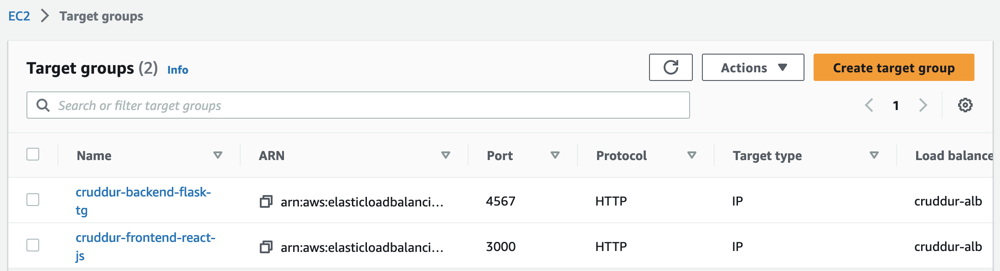

# Week 6 — Deploying Containers


## Required Homework

### Deploy an ECS Cluster using ECS Service Connect

I ran the command below on the aws cli to create ECS cluster name cruddur
```sh
aws ecs create-cluster \
--cluster-name cruddur \
--service-connect-defaults namespace=cruddur
```


### Deploy serverless containers using Fargate for the Backend and Frontend Application

Logined in to ECR on aws cli using
```sh
aws ecr get-login-password --region $AWS_DEFAULT_REGION | docker login --username AWS --password-stdin "$AWS_ACCOUNT_ID.dkr.ecr.$AWS_DEFAULT_REGION.amazonaws.com"
```
I created an ECR (Elastic Container Registery) Reposittory
- backend-flask
```sh
aws ecr create-repository \
  --repository-name backend-flask \
  --image-tag-mutability MUTABLE
```
- Frontend-react-js
```sh
aws ecr create-repository \
  --repository-name frontend-react-js \
  --image-tag-mutability MUTABLE
```
- cruddur-python
```sh
aws ecr create-repository \
  --repository-name cruddur-python \
  --image-tag-mutability MUTABLE
```


Build docker images
- backend-flask
```sh
docker build -t backend-flask .
```
- Frontend-react-js
```sh
docker build \
--build-arg REACT_APP_BACKEND_URL="http://cruddur-alb-1591977895.us-east-1.elb.amazonaws.com:4567" \
--build-arg REACT_APP_AWS_PROJECT_REGION="$AWS_DEFAULT_REGION" \
--build-arg REACT_APP_AWS_COGNITO_REGION="$AWS_DEFAULT_REGION" \
--build-arg REACT_APP_AWS_USER_POOLS_ID="$AWS_COGNITO_USER_POOL_ID" \
--build-arg REACT_APP_CLIENT_ID="$AWS_COGNITO_USER_POOL_CLIENT_ID" \
-t frontend-react-js \
-f Dockerfile.prod \
.
```
- Set ECR URL
```sh
export ECR_BACKEND_FLASK_URL="$AWS_ACCOUNT_ID.dkr.ecr.$AWS_DEFAULT_REGION.amazonaws.com/backend-flask"
echo $ECR_BACKEND_FLASK_URL
```

Tagged and pushed Images to ECR repo.
- backend-flask
```sh
docker tag backend-flask:latest $ECR_BACKEND_FLASK_URL:latest
docker push $ECR_BACKEND_FLASK_URL:latest
```
- Frontend-react-js
```sh
docker tag frontend-react-js:latest $ECR_FRONTEND_REACT_URL:latest
docker push $ECR_FRONTEND_REACT_URL:latest
```
#### Create Task Defintions
To Create task definition for backend-flask and frontend-react-js
- I created `CruddurServiceExecutionRole` and added `CruddurServiceExecutionPolicy`

```json
{
    "Version": "2012-10-17",
    "Statement": [
        {
            "Sid": "VisualEditor0",
            "Effect": "Allow",
            "Action": [
                "ecr:GetAuthorizationToken",
                "ecr:BatchCheckLayerAvailability",
                "ecr:GetDownloadUrlForLayer",
                "ecr:BatchGetImage",
                "logs:CreateLogStream",
                "logs:PutLogEvents"
            ],
            "Resource": "*"
        },
        {
            "Sid": "VisualEditor1",
            "Effect": "Allow",
            "Action": [
                "ssm:GetParameters",
                "ssm:GetParameter"
            ],
            "Resource": "arn:aws:ssm:us-east-1:860027186733:parameter/cruddur/backend-flask/*"
        }
    ]
}
```
- I also created `CruddurTaskRole` and added the following policies
  -  CloudWatchFullAccess
  -  AWSXRayDaemonWriteAccess
  -  SSMAccessPolicy

- Inorder to securely pass sensitive data to the task definition, I stored the values of the data in the paramenter stores
```sh
aws ssm put-parameter --type "SecureString" --name "/cruddur/backend-flask/AWS_ACCESS_KEY_ID" --value $AWS_ACCESS_KEY_ID
aws ssm put-parameter --type "SecureString" --name "/cruddur/backend-flask/AWS_SECRET_ACCESS_KEY" --value $AWS_SECRET_ACCESS_KEY
aws ssm put-parameter --type "SecureString" --name "/cruddur/backend-flask/CONNECTION_URL" --value $PROD_CONNECTION_URL
aws ssm put-parameter --type "SecureString" --name "/cruddur/backend-flask/ROLLBAR_ACCESS_TOKEN" --value $ROLLBAR_ACCESS_TOKEN
aws ssm put-parameter --type "SecureString" --name "/cruddur/backend-flask/OTEL_EXPORTER_OTLP_HEADERS" --value "x-honeycomb-team=$HONEYCOMB_API_KEY"
```
**Task Definition JSON Files**
- `backend-flask` Task Definition
```json
{
  "family": "backend-flask",
  "executionRoleArn": "arn:aws:iam::860027186733:role/CruddurServiceExecutionRole",
  "taskRoleArn": "arn:aws:iam::860027186733:role/CruddurTaskRole",
  "networkMode": "awsvpc",
  "cpu": "256",
  "memory": "512",
  "requiresCompatibilities": [ 
    "FARGATE" 
  ],
  "containerDefinitions": [
    {
      "name": "backend-flask",
      "image": "860027186733.dkr.ecr.us-east-1.amazonaws.com/backend-flask",
      "essential": true,
      "healthCheck": {
        "command": [
          "CMD-SHELL",
          "python /backend-flask/bin/flask/health-check"
        ],
        "interval": 30,
        "timeout": 5,
        "retries": 3,
        "startPeriod": 60
      },
      "portMappings": [
        {
          "name": "backend-flask",
          "containerPort": 4567,
          "protocol": "tcp", 
          "appProtocol": "http"
        }
      ],
      "logConfiguration": {
        "logDriver": "awslogs",
        "options": {
            "awslogs-group": "cruddur",
            "awslogs-region": "us-east-1",
            "awslogs-stream-prefix": "backend-flask"
        }
      },
      "environment": [
        {"name": "OTEL_SERVICE_NAME", "value": "backend-flask"},
        {"name": "OTEL_EXPORTER_OTLP_ENDPOINT", "value": "https://api.honeycomb.io"},
        {"name": "AWS_COGNITO_USER_POOL_ID", "value": "us-east-1_RF93UwMKk"},
        {"name": "AWS_COGNITO_USER_POOL_CLIENT_ID", "value": "35tni6c9nivok3l798707lmhtb"},
        {"name": "FRONTEND_URL", "value": "*"},
        {"name": "BACKEND_URL", "value": "*"},
        {"name": "AWS_DEFAULT_REGION", "value": "us-east-1"}
      ],
      "secrets": [
        {"name": "AWS_ACCESS_KEY_ID"    , "valueFrom": "arn:aws:ssm:us-east-1:860027186733:parameter/cruddur/backend-flask/AWS_ACCESS_KEY_ID"},
        {"name": "AWS_SECRET_ACCESS_KEY", "valueFrom": "arn:aws:ssm:us-east-1:860027186733:parameter/cruddur/backend-flask/AWS_SECRET_ACCESS_KEY"},
        {"name": "CONNECTION_URL"       , "valueFrom": "arn:aws:ssm:us-east-1:860027186733:parameter/cruddur/backend-flask/CONNECTION_URL" },
        {"name": "POSTGRESQL_PROD_CONNECTION_URL"       , "valueFrom": "arn:aws:ssm:us-east-1:860027186733:parameter/cruddur/backend-flask/CONNECTION_URL" },
        {"name": "ROLLBAR_ACCESS_TOKEN" , "valueFrom": "arn:aws:ssm:us-east-1:860027186733:parameter/cruddur/backend-flask/ROLLBAR_ACCESS_TOKEN" },
        {"name": "OTEL_EXPORTER_OTLP_HEADERS" , "valueFrom": "arn:aws:ssm:us-east-1:860027186733:parameter/cruddur/backend-flask/OTEL_EXPORTER_OTLP_HEADERS" }
      ]
    }
  ]
}
```

- `frontend-react-js` Task Definition
```json
{
    "family": "frontend-react-js",
    "executionRoleArn": "arn:aws:iam::860027186733:role/CruddurServiceExecutionRole",
    "taskRoleArn": "arn:aws:iam::860027186733:role/CruddurTaskRole",
    "networkMode": "awsvpc",
    "cpu": "256",
    "memory": "512",
    "requiresCompatibilities": [ 
      "FARGATE" 
    ],
    "containerDefinitions": [
      {
        "name": "frontend-react-js",
        "image": "860027186733.dkr.ecr.us-east-1.amazonaws.com/frontend-react-js",
        "essential": true,
        "healthCheck": {
          "command": [
            "CMD-SHELL",
            "curl -f http://localhost:3000 || exit 1"
          ],
          "interval": 30,
          "timeout": 5,
          "retries": 3
        },
        "portMappings": [
          {
            "name": "frontend-react-js",
            "containerPort": 3000,
            "protocol": "tcp", 
            "appProtocol": "http"
          }
        ],
  
        "logConfiguration": {
          "logDriver": "awslogs",
          "options": {
              "awslogs-group": "cruddur",
              "awslogs-region": "us-east-1",
              "awslogs-stream-prefix": "frontend-react-js"
          }
        }
      }
    ]
  }
```

#### Register Task Defintions
- Backend-flask
```sh
aws ecs register-task-definition --cli-input-json file://aws/task-definitions/backend-flask.json
```
- Frontend-react-js
```sh
aws ecs register-task-definition --cli-input-json file://aws/task-definitions/frontend-react-js.json
```


### Route traffic to the frontend and backend on different subdomains using Application Load Balancer

#### Create A Load Balancer
I created a Load balancer named `cruddur-lb` to listen to port `3000` and port `4567`


#### Created Services

- `backend-flask` service 
Ran the following command on the aws cli to create the backend service
```sh
aws ecs create-service --cli-input-json file://aws/json/service-backend-flask.json
```
Here is the content of `file://aws/json/service-backend-flask.json`
```json
{
    "cluster": "cruddur",
    "launchType": "FARGATE",
    "desiredCount": 1,
    "enableECSManagedTags": true,
    "enableExecuteCommand": true,
    "loadBalancers": [
      {
          "targetGroupArn": "arn:aws:elasticloadbalancing:us-east-1:860027186733:targetgroup/cruddur-backend-flask-tg/0cfe3efa0bc9d150",
          "containerName": "backend-flask",
          "containerPort": 4567
      }
    ],
    "networkConfiguration": {
      "awsvpcConfiguration": {
        "assignPublicIp": "ENABLED",
        "securityGroups": [
          "sg-036b68b04d2889fa6"
        ],
        "subnets": [
            "subnet-0b087c85b44815ab8",
            "subnet-0985ebd762a0276a7",
            "subnet-084b53ce45e3c7124"
        ]
      }
    },
    "serviceConnectConfiguration": {
      "enabled": true,
      "namespace": "cruddur",
      "services": [
        {
          "portName": "backend-flask",
          "discoveryName": "backend-flaskd",
          "clientAliases": [{"port": 4567}]
        }
      ]
    },
    "propagateTags": "SERVICE",
    "serviceName": "backend-flask",
    "taskDefinition": "backend-flask"
  }
```


-  `frontend-react-js` service
Ran the command below on the aws cli to create the rontend-react-js service
```sh
aws ecs create-service --cli-input-json file://aws/json/service-frontend-react-js.json
```
Here is the content of `file://aws/json/service-frontend-react-js.json`
```json
{
    "cluster": "cruddur",
    "launchType": "FARGATE",
    "desiredCount": 1,
    "enableECSManagedTags": true,
    "enableExecuteCommand": true,
    "loadBalancers": [
      {
        "targetGroupArn": "arn:aws:elasticloadbalancing:us-east-1:860027186733:targetgroup/cruddur-frontend-react-js/4c2a6b805b108ef0",
        "containerName": "frontend-react-js",
        "containerPort": 3000
      }
    ],
    "networkConfiguration": {
      "awsvpcConfiguration": {
        "assignPublicIp": "ENABLED",
        "securityGroups": [
            "sg-036b68b04d2889fa6"
          ],
        "subnets": [
            "subnet-0b087c85b44815ab8",
            "subnet-0985ebd762a0276a7",
            "subnet-084b53ce45e3c7124"
        ]
      }
    },
    "propagateTags": "SERVICE",
    "serviceName": "frontend-react-js",
    "taskDefinition": "frontend-react-js",
    "serviceConnectConfiguration": {
      "enabled": true,
      "namespace": "cruddur",
      "services": [
        {
          "portName": "frontend-react-js",
          "discoveryName": "frontend-react-js",
          "clientAliases": [{"port": 3000}]
        }
      ]
    }
  }
```


I created two target groups to tell the load balancer `cruddur-lb` to direct traffic to `backend-flask` and `frontend-react-js`




Here are my running tasks 


Here is my cruddur cluster showing running task


### Securing our flask container


### Creating several bash utility scripts to easily work with serverless containers.

#### RDS connection Test
Because PosgreSQL (PSQL) command will not be installed in the container, I created a python script to test RDS Posgres connection.
```
#!/usr/bin/env python3

import psycopg
import os
import sys

connection_url = os.getenv("POSTGRESQL_PROD_CONNECTION_URL")

conn = None
try:
  print('attempting connection')
  conn = psycopg.connect(connection_url)
  print("Connection successful!")
except psycopg.Error as e:
  print("Unable to connect to the database:", e)
finally:
  conn.close()
 ```

#### Health Check
```sh
#!/usr/bin/env python3

import urllib.request

try:
  response = urllib.request.urlopen('http://localhost:4567/api/health-check')
  if response.getcode() == 200:
    print("[OK] Flask server is running")
    exit(0) # success
  else:
    print("[BAD] Flask server is not running")
    exit(1) # false
# This for some reason is not capturing the error....
#except ConnectionRefusedError as e:
# so we'll just catch on all even though this is a bad practice
except Exception as e:
  print(e)
  exit(1) # false
```


#### Connect to ECS Container
```sh
#! /usr/bin/bash
if [ -z "$1" ]; then
  echo "No TASK_ID argument supplied eg ./bin/ecs/connect-to-service 99b2f8953616495e99545e5a6066fbb5d backend-flask"
  exit 1
fi
TASK_ID=$1

if [ -z "$2" ]; then
  echo "No CONTAINER_NAME argument supplied eg ./bin/ecs/connect-to-service 99b2f8953616495e99545e5a6066fbb5d backend-flask"
  exit 1
fi
CONTAINER_NAME=$2

echo "TASK ID : $TASK_ID"
echo "Container Name: $CONTAINER_NAME"

aws ecs execute-command  \
--region $AWS_DEFAULT_REGION \
--cluster cruddur \
--task $TASK_ID \
--container $CONTAINER_NAME \
--command "/bin/sh" \
--interactive
```

#### Login to ECR
```sh
#!/usr/bin/env bash
# Login to EWS ECR
aws ecr get-login-password --region $AWS_DEFAULT_REGION | docker login --username AWS --password-stdin "860027186733.dkr.ecr.$AWS_DEFAULT_REGION.amazonaws.com"
```


